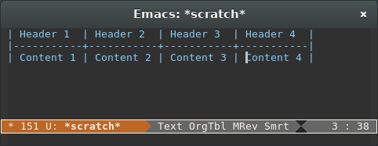

# orgtbl-show-header

## Summary

In Emacs Org mode, this minor mode shows the header of the current column in the minibuffer.

## Installation

Use a package manager (the package is on [MELPA](http://melpa.org)) or copy `orgtbl-show-header.el` to your `load-path`.

## Usage

In your Org file, type `M-x  orgtbl-show-header`. When you press `TAB` or `S-TAB` in a table, you will see the header of the current column printed in the minibuffer.

## Contributing

Yes, please do! See [CONTRIBUTING][] for guidelines.

## License

See [COPYING][]. Copyright (c) 2014 Damien Cassou.

[CONTRIBUTING]: ./CONTRIBUTING.md
[COPYING]: ./COPYING
